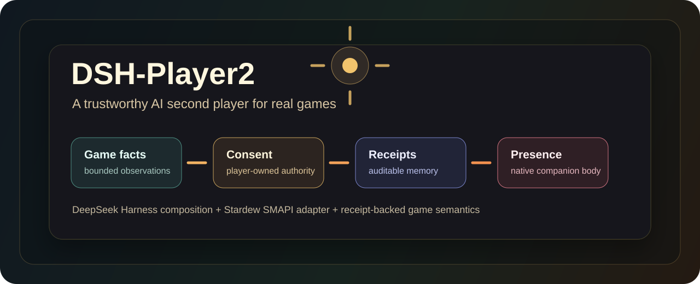

# DSH-Player2

<p align="center">
  
</p>

<p align="center">
  <strong>An AI second player for games, starting with Stardew Valley.</strong><br>
  Player2 explores a companion who can see bounded game facts, talk in the native game UI,
  ask before acting, remember receipt-backed outcomes, and appear as a native in-world body.
</p>

<p align="center">
  <a href="https://github.com/Alex-Yanggg/DSH-Player2/actions/workflows/ci.yml"></a>
  
  
  
  
</p>

## What It Is

DSH-Player2 is a public reference application for building a trustworthy, game-native AI companion on top of [DeepSeek Harness](https://github.com/dsh2026/test-Alex-Yanggg). It does not fork, vendor, or patch Harness internals; Player2 owns game semantics, grounding, consent, receipts, and presentation.

The current vertical slice runs in Stardew Valley through SMAPI. It is deliberately narrow: prove the companion can participate honestly in a small player-controlled loop before expanding into broader game work.

## Current Slice

| Capability | Current behavior |
| --- | --- |
| Native game UI | F2 opens a compact companion chat overlay with scrollback, input recall, waiting states, and per-save history. |
| Grounded dialogue | Social replies come from the mounted DSH companion plugin and must validate against current game facts. |
| Consent-first decisions | Day turns publish bounded observations, receive a proposal, ask the player, and record a terminal receipt. |
| Receipt memory | Later turns may recall newest receipt-backed outcomes; memories cannot grant authority or fabricate observations. |
| Companion presence | The player chooses a companion identity and native Stardew appearance; Player2 renders through game-native farmer drawing. |
| Movement commands | Explicit chat commands such as `/come`, `/follow`, and `/stay` drive bounded native pathfinding after validated replies. |
| Autonomy tiers | `consult` keeps proposal -> consent -> receipt; `full` allows grounded companion-owned orders through the same receipt path. |
| Self-growth lane | Receipt-grounded reflections can update a Player-owned growth asset without touching soul, capabilities, or authority. |

## What It Is Not

- Not an unattended farming bot.
- Not a cheat layer or save editor.
- Not a second DeepSeek Harness runtime.
- Not a place to patch Harness as a side effect of game work.
- Not a claim that every Stardew mechanic is already supported.

## Quick Start

Prerequisites:

- Stardew Valley with SMAPI 4.5+
- .NET 6 SDK
- Node.js 24.x
- An existing DeepSeek Harness checkout/profile with the Player2 host bundle installed

Install dependencies and verify the keyless core:

```powershell
npm ci
npm run accept:0.1.4
```

Install the Player2 DSH bundle into the Harness profile you run:

```powershell
dsh plugin --profile web add ./packages/dsh-host-plugin
```

Build and deploy the Stardew mod from a Windows checkout with Stardew installed:

```powershell
dotnet build .\stardew-mod\DSHPlayer2.Stardew.csproj --configuration Release -p:OS=Windows_NT
```

Start the game through `StardewModdingAPI.exe`, load a save, choose or customize a companion, and press **F2** in game to talk.

## Verification

The reproducible keyless regression is:

```powershell
npm run accept:0.1.4
```

That chain type-checks and tests the TypeScript packages, runs social/decision/dispatch/dual-end replays, exercises receipt recall, autonomous execution, reflection, and the dream-event spine. Public CI also runs the documentation verifier and pure C# core tests.

The SMAPI adapter still needs local game assemblies, so GitHub-hosted CI cannot honestly build it. Use the manual path in [stardew-mod/README.md](stardew-mod/README.md) for game-side validation.

## Architecture

```text
Stardew / SMAPI host
  observes bounded facts, presents chat/consent, validates receipts
          |
          v
Player2 bridge
  immutable turn files, grants, receipts, session layout, development logs
          |
          v
DeepSeek Harness companion plugin
  persona, grounded social replies, proposal tools, recall, reflection
          |
          v
Player-owned authority
  only validated grants or configured autonomy can reach game mechanics
```

Read [docs/architecture.md](docs/architecture.md) for the full split between Harness composition, Player authority, adapter modes, receipt memory, persona mounting, and the self-growth spine.

## Repository Map

| Path | Purpose |
| --- | --- |
| [packages/contracts](packages/contracts/src/index.ts) | Versioned observations, capabilities, proposals, grants, receipts, and adapter contracts. |
| [packages/runtime](packages/runtime/src/index.ts) | Cross-game proposal, permission, social-turn, and validation runtime. |
| [packages/dsh-companion-plugin](packages/dsh-companion-plugin/src/index.ts) | Harness-mounted companion composition, tools, policy, recall, reflection, and invariants. |
| [packages/dsh-host-plugin](packages/dsh-host-plugin/src/index.ts) | Live DSH bundle that watches the Player2 bridge inside the active Harness profile. |
| [player2-core](player2-core/DSHPlayer2.Core.csproj) | Pure C# bridge contracts, layout, rules, growth store, movement, and host logic. |
| [stardew-mod](stardew-mod/README.md) | SMAPI adapter, native UI, companion rendering, chat, and local game verification. |
| [fixtures](fixtures) | Keyless social, decision, replay, autonomy, reflect, and dream-cycle evidence. |
| [docs](docs/architecture.md) | Architecture, CI, development mode, operating model, and task-specific notes. |

## Development Rules

Read [AGENTS.md](AGENTS.md) and [docs/operating-model.md](docs/operating-model.md) before non-trivial changes. The short version:

- keep every capability bounded by explicit game facts, advertised capabilities, consent, receipts, or a configured autonomy tier;
- preserve the DSH boundary and use public Harness contracts only;
- add focused tests or replay fixtures for behavior changes;
- document every user-visible game behavior with a reproducible manual check;
- never store credentials, game assets, private saves, or machine-specific paths in the repo.

## Status

This repository is still a development build. The 0.1.x line has a playable Stardew vertical slice and a strong keyless regression chain, but no public release package and no selected license yet. Detailed change history lives in [CHANGELOG.md](CHANGELOG.md).
